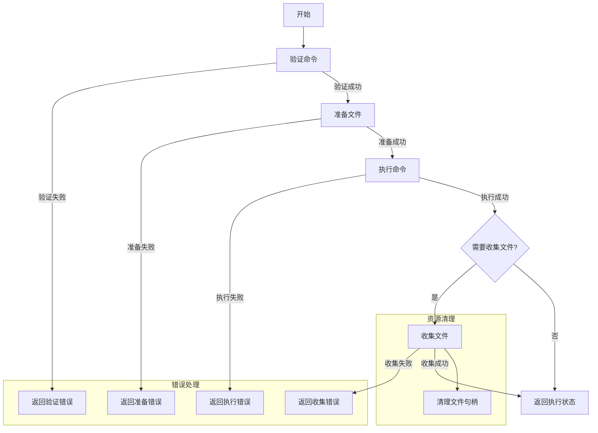

```mermaid
graph TB
    Start[开始] --> Validate[验证命令]
    Validate -- 验证失败 --> Error1[返回验证错误]
    Validate -- 验证成功 --> Prepare[准备文件]
    Prepare -- 准备失败 --> Error2[返回准备错误]
    Prepare -- 准备成功 --> Execute[执行命令]
    Execute -- 执行失败 --> Error3[返回执行错误]
    Execute -- 执行成功 --> CheckCopyOut{需要收集文件?}
    CheckCopyOut -- 是 --> Collect[收集文件]
    Collect -- 收集失败 --> Error4[返回收集错误]
    Collect -- 收集成功 --> Return[返回执行状态]
    CheckCopyOut -- 否 --> Return
    
    subgraph 错误处理
        Error1
        Error2
        Error3
        Error4
    end
    
    subgraph 资源清理
        Collect --> Cleanup[清理文件句柄]
    end
```